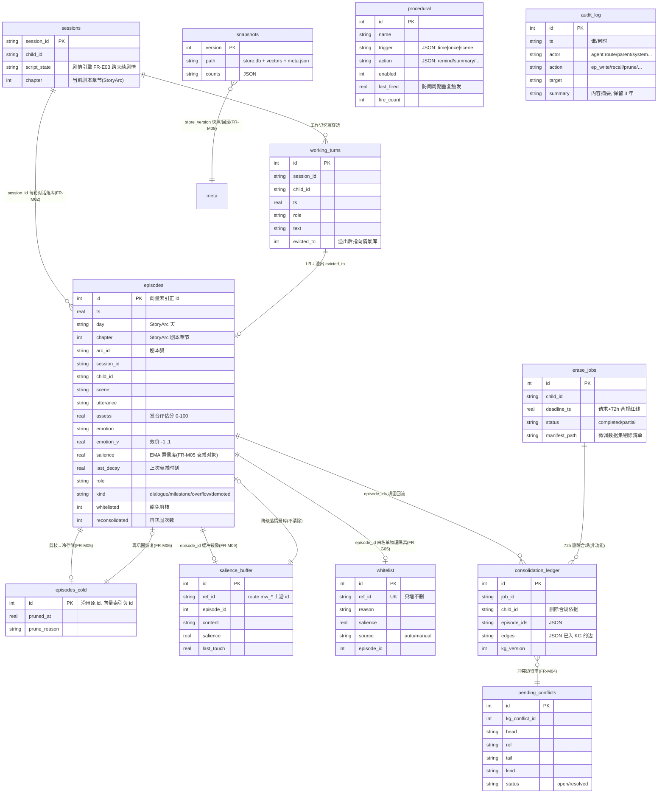

# 五库 Schema · ER 图（FR-M01 验收）

> 语义库 = KG（`kb/data/kg.db`，由 02 KG 工作流全权所有），本模块不建表，
> 仅经热更接口衔接（`/kg/runtime-consolidate`、`/kg/edges:batch`、`/kg/conflicts`）。
> 其余四库 + 引擎表物理存于 `data/store.db`（SQLite WAL），冷存储 `episodes_cold`
> 与白名单 `whitelist` 均为物理分表（FR-M05 物理隔离）。

## 向量索引（`data/vectors.faiss`）

- `IndexIDMap2(IndexFlatIP)`，dim=256（`EMBED_DIM` 可调）。
- **id 约定**：情景库热存储 = `episodes.id`（正数），冷存储 = `-id`（负数）——
  单索引同时服务跨天召回与冷存储再巩固检索。
- 嵌入为确定性特征哈希（词 token + 中文字符 2/3-gram → L2 归一），保证
  "SQLite 原始数据可重建索引"（FAISS 损坏对策，README §6 风险表）；
  生产可替换神经编码器，`POST /memory/index/rebuild` 全量重嵌入。

## 版本与快照

- `meta.store_version` 单调递增：任何写路径（episode/程序性/剪枝/巩固/白名单/删除）+1。
- 快照以版本号为目录名 `data/snapshots/v{n}/`：`store.db`（SQLite backup API，
  含 WAL 合并）+ `vectors.*` + `meta.json`；先注册后备份，回滚后注册表不丢。
- 回滚：拷回 db+向量 → 从恢复库全量重建索引（保证库/向量一致）→
  版本 `max(当前, v)+1` 继续递增（对齐 kg 侧约定）。
