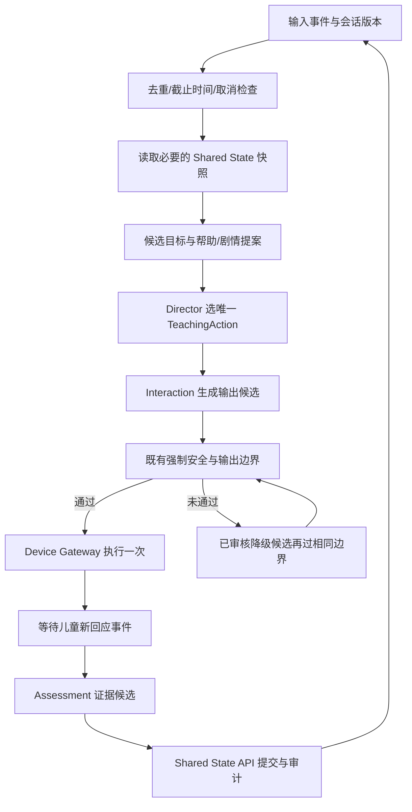

# SHE MAS 与 Agentic Loop / Hook 设计参考

> 状态：**已实现第一阶段学习循环；本文完整扩展架构仍是后续提案**。
> 实际代码、验证与限制见 [第一阶段实现](../../agents/director/docs/learning-loop.md)。
> 日期：2026-09-08。CC 在本文中指 Claude Code。
> Claude Code、Codex、Hermes Agent 仅供设计参考，不是 SHE 的运行依赖。
> 本文的事件名、类型、预算与伪代码都是 SHE 建议方案，不是三个产品的兼容配置。

## 1. 背景与痛点

SHE 是儿童英语陪伴系统，不是通用编程助手。它需要在短时间内完成感知、教学选择、
语言表达、输出执行与证据归档，同时确保儿童只感知到一个稳定角色“小P”。

| 痛点 | 如果仅依赖 Prompt | 需要的工程机制 |
| --- | --- | --- |
| 多个角色建议相互冲突 | 每个 Agent 都能给出看似合理但不同的教学行动 | Director 单一裁决；结构化 Proposal；决策原因可回放 |
| 慢调用、失败和重复事件 | 无限重试、重复回应，孩子等待 | 有限预算、截止时间、去重、取消与预先审核的降级路径 |
| “做完了”没有证据 | 模型自述成功被当作完成 | 完成条件由状态与验收结果决定 |
| 子任务共享过量上下文 | 成本增长、隐私暴露、指令污染 | 按职责裁剪输入，只返回结构化摘要与证据引用 |
| 观察逻辑和控制逻辑混杂 | 日志失败拖垮主流程，或错误被静默放行 | Observer、Gate、Transform 分离，分别定义失败语义 |
| 长期记忆被单次错误污染 | 低置信判断直接进入画像 | candidate/confirmed 区分；仅经 Shared State API 写入 |
| 调试经验无法复用 | 每次增加 Prompt，无法证明收益 | 离线重放、固定指标、版本化配置与小步灰度 |

### 设计前基线与后续目标必须分开

- `agents/director/src/learning-director.ts` 设计前按代码顺序调用 Curriculum、Scaffold、Story、
  Assessment、Learner Model，并返回一个 `teaching_action`。这不等于七个独立 LLM 的自由对话网络。
- `agents/director/src/hooks.ts` 已有系统钩子和工具边界，不是本文建议的新通用生命周期总线。
  本次不修改其中的安全过滤、注入检测或权限规则。
- `agents/director/src/audit.ts` 提供现有审计记录；本文建议的 event/span 字段尚未落地。
- `POST /agent/direct` 是现有新入口；不以 `/agent/dispatch` 的旧命名建立新架构。
- Shared State、Device Gateway、Interaction 的职责以仓库 `AGENTS.md` 为准；RDK X5 真机不在本次范围。

## 2. 三个参考项目：相同点与不同点

资料检索并打开官方页面后整理。以下是能力摘要，不代表本机安装版本已经具有这些能力；
产品文档会变化，实施前应针对选定发行版本复核。

### 2.1 Claude Code

生命周期事件覆盖会话、回合、工具前后和子 Agent。Hook 可以由命令、HTTP、MCP、Prompt
或 Agent 实现；不同事件有不同决策语义。`Stop` 的阻止可能让运行继续，必须防止重复续跑。
这是“流程关键点可插入检查”的参考，而不是让 LLM 自己宣布通过。
[官方 Hooks 文档](https://code.claude.com/docs/en/hooks)

子 Agent 拥有独立上下文以及可配置工具/权限；适合把大量探索内容隔离后，向主 Agent 返回摘要。
SHE 可借鉴职责和输入边界，不能照搬通用文件/终端访问。
[官方 Subagents 文档](https://code.claude.com/docs/en/sub-agents)

### 2.2 Codex

官方 Hook 文档描述了工具前后、停止等生命周期扩展。`PreToolUse` 可在支持的工具路径上阻止
或改写调用；文档明确指出部分专用路径可能不走通用 Hook，因此 Hook 不能独自构成完整安全边界。
`Stop` 的 block 表示要求继续，和“拒绝一次工具操作”不能混为一谈。
[官方 Hooks 文档](https://learn.chatgpt.com/docs/hooks)

子 Agent 可承担独立任务并返回摘要；官方建议优先并行读密集任务，谨慎处理同时写入造成的冲突。
SHE 可借鉴有界分工与结果汇总，而不把所有教学步骤都并行化。
[官方 Subagents 文档](https://learn.chatgpt.com/docs/agent-configuration/subagents)

### 2.3 Hermes Agent

其文档区分 Gateway、Plugin、Shell 和外发 Webhook，观察与可改变流程的扩展不是同一类。
`pre_tool_call` 能参与工具控制；Shell Hook 的 fail-closed 行为需要显式理解配置。
`pre_verify` 是有边界的代码验证续跑门，不应直接当作儿童教学回合结束规则。
SHE 可借鉴明确的事件分类、错误策略和续跑上限。
[官方 Event Hooks 文档](https://hermes-agent.nousresearch.com/docs/user-guide/features/hooks/)

### 2.4 对照结论

| 维度 | Claude Code | Codex | Hermes Agent | SHE 取舍（本项目设计推导） |
| --- | --- | --- | --- | --- |
| 扩展点 | 会话/回合/工具/子 Agent 事件 | 生命周期与工具路径 | 多类 Hook 系统 | 定义少量稳定的业务事件，不复制所有平台事件 |
| 子任务 | 独立上下文和能力配置 | 有界分工、主任务汇总 | 有委派机制，见官方委派文档 | Director 是唯一决策协调者，职责不等于独立进程 |
| 完成检查 | Stop 可能继续运行 | Stop block 可触发续跑 | pre_verify 有续跑边界 | 明确 `continue / fallback / complete / cancel` 四种结果 |
| 工具控制 | 事件特定的控制返回 | 不能视为全工具安全覆盖 | 不同 Hook 的阻止能力不同 | 权限在服务边界强制执行，Hook 只补充检查 |
| 日志与控制 | 同一框架有多类事件 | 事件返回值语义不同 | 显式区分观察与控制 | 监控失败可降级；强制门失败不能当成 allow |
| 适用环境 | 通用编码工作流 | 通用编码与任务协作 | 通用 Agent / Gateway | 儿童实时链路：无开放互联网、无任意 Shell、无自动自改规则 |

Hermes 委派机制仅作为概念参考，本文不假定它和 Codex/Claude Code 有一致的隔离模型或配置格式。
[官方 Subagent Delegation](https://hermes-agent.nousresearch.com/docs/user-guide/features/delegation)

**共同原则的项目推导**：模型负责提出候选，运行框架负责生命周期和预算，后端服务负责最终权限与持久化。
不应因三个项目都叫“Hook”，就假设事件触发频率、失败处理或返回 JSON 可以互换。

## 3. 推荐 MAS 结构

不新增“万能 Hook Agent”。Loop Controller 是确定性普通代码，归属 `agents/director`。
七个教学职责保留，是否需要独立模型调用由离线效果与延迟数据决定。

| 职责 | 输入 | 输出 | 允许的后台/状态范围 | 失败处理 |
| --- | --- | --- | --- | --- |
| Learner Model | 已审计证据、版本化画像快照 | 能力摘要/候选更新 | Shared State 读；受控 evidence 写申请 | 不产生新的长期判断 |
| Curriculum | 能力摘要、家长约束、审核知识 | 学习目标 Proposal | 审核 KG 检索 | 已审核通用目标或暂停 |
| Scaffold | 目标、近期尝试、有效帮助等级 | 帮助方式 Proposal | 当前会话只读 | 保守帮助方式 |
| Story | 已确定目标、剧情状态 | 剧情动作 Proposal | 本地审核内容/Story State | 通用已审核场景 |
| Director | 上述 Proposal、预算、情绪优先级 | 唯一 TeachingAction | 调度与会话状态，不直写数据库 | pause/降级候选 |
| Interaction | TeachingAction、审核事实与模板 | 儿童输出候选 | 仅审核内容，不访问设备驱动 | 已审核模板 |
| Assessment | 对应 action 的回应与评估结果 | Evidence 候选 | 固定 evaluator 约束，不能自行修改 | 不确认 mastery |

上述表不是新增 Agent 注册表；各角色的完整现有职责继续参照 `docs/architecture/02-agents.md`。
所有面向儿童的语言只经过 Interaction，设备命令只经过 Device Gateway。

## 4. Agentic Loop：等待真实回应，而非自我对话



图中降级只允许有限次数，不能形成无限环。取消、隐私撤回或输出边界不可用时进入终止态；
此时不能以“不空响应”为理由继续播放或绕过检查。

### 状态机与硬停止条件

`received → planning → candidate_ready → output_checked → dispatched → awaiting_input → settled`。
旁路终态：`cancelled`、`expired`、`failed_closed`。降级是有限转移，不是独立无限循环。

- 一次输入事件最多产生一个被执行的 action；重试复用 `action_id`。
- `awaiting_input` 后不得把模型自己的上一次输出伪装成儿童新输入。
- `language_level` 与 `scaffold_level` 分别保留，不能统一成一个 difficulty。
- 预算耗尽不等于完成；返回明确降级/过期原因。
- 新的停止事件取消旧 turn；迟到结果必须验证 epoch 后才能进入下一阶段。
- 不修改既有安全过滤、摄像头生命周期、数据删除或 evaluator。

## 5. Hook 类型与生命周期

| 建议事件 | 类型 | 用途 | 失败语义 |
| --- | --- | --- | --- |
| turn.received | Observer | 最小审计与延迟起点 | 监控失败记录计数，不改业务输入 |
| context.ready | Gate | 输入 schema、快照版本、必需字段 | 缺失则降级/拒绝当前计划，不能伪造字段 |
| proposal.ready | Gate | 单目标、版本与预算检查 | 最多一次有限重规划 |
| tool.requested | Gate | 额外业务约束检查 | 错误/超时视为未获准；服务边界仍独立鉴权 |
| tool.completed | Observer | 用量、耗时、结果状态码 | 不能重放工具，也不能注入自由文本指令 |
| output.candidate | Gate | 调用既有审核边界、保存判定引用 | 未通过不能输出；Hook 不实现/替代安全策略 |
| output.dispatched | Observer | 关联 action/command/ack | 不把“已提交”当“已送达” |
| evidence.proposed | Gate | action 关联、置信和版本约束 | 保持 candidate，不直接写 mastery |
| turn.settled | Observer | 指标与追踪闭合 | 异步、幂等、最小化数据 |
| turn.cancelled | Controller event | 取消子任务、禁止迟到副作用 | 单调终态，观察者不能恢复回合 |

Transform 只建议用于离线格式归一化或已审核内容的展示转换。实时 Hook 不允许改写儿童原话、
提高证据置信度、放宽权限，也不能在审核后改变最终要输出的内容。

### 顺序、冲突与故障隔离

1. 在每个 Gate 边界检查 deadline、cancel token 和输入 schema。
2. Gate 按稳定 priority 顺序执行，任一拒绝即拒绝；Observer 返回值一律不参与控制。
3. Hook handler 必须在显式注册表内，禁用从外部文本动态拼接模块路径/命令。
4. 初期只支持进程内受控函数，不引入任意 Shell/外发 HTTP Hook。
5. 超时不等于任务已停止。使用 AbortSignal 配合 adapter 取消；不能取消的请求返回值隔离丢弃。
6. Gate 总预算也是预算的一部分；不能每个 Hook 分别拿完整回合超时。
7. 强制审核路径不可被 feature flag 关闭；可开关的只是不影响授权结果的可选 Observer。

## 6. 草案数据结构与接口

以下为文档内 TypeScript 示意，**不是已发布共享契约**。实施时先在 `shared/contracts/` 提交
JSON Schema、有效/无效 fixtures 与 validator 测试，再修改 Director/后端/客户端。

```ts
type HookEvent = {
  schema_version: "draft-1";
  event_id: string;
  trace_id: string;
  turn_id: string;
  session_ref: string;       // 服务端授权域内的不透明引用
  action_id?: string;
  epoch: number;             // 取消/替换回合后改变
  stage: string;             // 实现时限定为上表枚举
  attempt: number;
  deadline_at: string;
  policy_version: string;
  input_schema_version: string;
  snapshot_version: string;
  evidence_refs: string[];   // 不存原话、音频、图像
};
type GateDecision =
  | { kind: "allow"; reason_code: string }
  | { kind: "replan"; reason_code: string }
  | { kind: "fallback"; reason_code: string; approved_template_ref: string }
  | { kind: "deny"; reason_code: string };
type ObserverResult = void;
```

审计字段另外记录：`hook_id`、`hook_version`、`duration_ms`、`outcome`、`retry_count`、
`budget_remaining`、`cancelled`、`fallback_reason`、`write_status`。不记录完整工具参数或输出文本。
不要用未加密的儿童短语哈希当“脱敏”；字典攻击仍可能还原内容。

### 调度伪代码

```text
handle(event):
  claim = dedup.claim(event.id, session.epoch)
  if claim already settled: return previous metadata
  ctx = authorized_shared_state_snapshot(event.session_ref)
  budget = reserve_turn_budget()       # 数量与时间都有限
  try:
    for attempt in [0, 1]:
      require_current_epoch_and_deadline()
      proposals = propose_from_same_snapshot(ctx, budget)
      decision = validate_proposals(proposals, ctx.version)
      if decision denies: break
      action = director.select_one(proposals)
      candidate = interaction.render(action)
      checked = existing_output_boundary.check(candidate)
      if checked allows:
        require_current_epoch_and_deadline()
        gateway.dispatch_once(action.id, checked.bound_output)
        return mark_awaiting_real_input()
    return approved_fallback_through_same_output_boundary()
  on cancellation:
    invalidate_epoch_and_cancel_children()
    return cancelled_without_new_output
  finally:
    release_budget_reservations()
    emit_minimal_observer_event()       # 不在 finally 里执行设备或记忆写入
```

`checked.bound_output` 需绑定候选内容和 policy_version，防止校验后替换。此绑定是接口设计建议，
不能由新的 Hook 私自替代原有审核组件。

## 7. 并发、持久化与跨服务一致性

- **先串行再优化**：Curriculum 的目标是 Scaffold/Story 的依赖，不能盲目同时启动全部 Agent。
  同一快照的只读 KG/Memory 检索可在授权范围内并行；合并时检查版本与截止时间。
- **子任务有界**：建议首期 fan-out ≤2、深度 ≤1；禁止子 Agent 相互无限派单。这是初始工程假设，
  不是三个参考项目的默认参数，也不是已测得最优值。
- **单写者**：Director 只提交写入意图；Shared State API 是长期状态唯一写入口。
- **幂等键**：建议 `(turn_id, action_id, operation_kind)`；由接收服务检查，不只依赖客户端内存。
- **并发冲突**：写入携带 `expected_version`，不匹配时重新读快照；不可把旧 evidence 当作新确认。
- **跨服务结果不假装事务**：Gateway 提交、设备 ACK、Evidence 提交分别记状态。
  未 ACK 的输出不能被记为设备已执行；重连不重新创造 action_id。
- **存储故障**：当前会话可保守继续，但状态标记 pending；不能声称记忆已保存。
  若采用 outbox，也必须通过服务端 Shared State 能力实现，不能让 Agent 自建数据库文件。
- **会话压缩**：只保留目标、动作状态、待办/取消、证据引用与版本；不以摘要覆盖真实证据。

## 8. 初始预算与性能测量

以下是待离线验证的建议上限，不是上线 SLA：总规划尝试 2 次，单工具瞬时故障重试 1 次，
可选 Observer 总耗时预算 20ms，Hook 控制检查总预算 50ms。LLM 和设备时延预算需按实测单独设定。

重试前必须满足：错误可重试、操作幂等、预算足够、epoch 未变。权限拒绝、schema 错误、
用户取消和低置信视觉不能靠重复相同调用解决。

指标分别报告：首个可执行输出时延 P50/P95、Hook 额外耗时、超时率、取消后副作用数、重复执行数、
fallback 比例、无有效输出率、每回合工具/模型调用次数。成功率不能只统计最终返回 HTTP 200。

## 9. 验收与故障注入矩阵（未来实施时先写测试）

| 输入/故障 | 必须验证的行为 |
| --- | --- |
| 重复 event_id | 不再执行设备命令、不重复写 evidence |
| 相同动作在重试中返回 | action_id 不变；下游去重有效 |
| 子任务超时后迟到 | epoch/deadline 检查丢弃结果 |
| Observer 抛错 | 不改变 TeachingAction；增加可观测错误计数 |
| Gate 超时/无效返回 | 不被解释为 allow |
| 两个 Proposal 冲突 | 单一目标与固定优先级；记录选择原因 |
| 连续 replan | 到上限走审核降级，不无限循环 |
| 孩子/家长取消 | 不新增音频/灯效/摄像头操作 |
| 输出校验后被改写 | 绑定失效，重新过原有边界 |
| Memory 服务不可用 | 不伪造已保存、不提升 mastery |
| snapshot_version 冲突 | 拒绝旧版本写入并保留可重试状态 |
| 外部内容含伪指令 | 仅作为不可信数据，不能注册 Hook 或获取工具权限 |
| 正常端到端回合 | 等待真实回应，证据关联正确 action |

第一阶段仅实现固定六阶段生命周期、前一轮目标评估、有限追问和临时会话隔离。
上表中的跨服务幂等、取消 epoch、审核绑定、并行子任务和 Shared State 写入尚未实现；
不能以第一阶段测试通过推断上表全部通过。
现有基线命令：`npm test --prefix agents/director`、`npm run typecheck --prefix agents/director`、
`python -m pytest shared/contracts/tests -q`。实施新协议时应增加对应测试，再运行基线。

## 10. 迭代优化思路

### 阶段 A：只观察，建立基线

新增最小 trace（须先契约与隐私审查），暂不改变教学决策。用合成/审核样本回放，收集耗时、
重复与降级分布。产物是可重放事件和失败 fingerprint，而不是更多 Prompt。

### 阶段 B：确定性 Loop Controller

先落地 deadline、epoch、幂等、有限重试与明确终态。通过故障注入矩阵后再讨论多模型协作。
保持原有教学结果可对照；每个变化有版本、原因码和回滚开关。

### 阶段 C：有限并行与按需 Agent

只并行不存在数据依赖的读任务；用相同回放集比较串行/并行延迟和决策一致性。
若没有收益，保留普通函数。新增 Agent 必须证明独立上下文或专门推理带来的收益。

### 阶段 D：离线复盘闭环

汇总失败类型 → 人工确认根因 → 更新代码或审核内容 → 固定回归集 → 小流量灰度 → 观察回滚指标。
不得让线上 Agent 自动修改 verifier、安全过滤、KG 文件、长期记忆文件或自己的权限。
经验只有在步骤稳定、可重复、有验证命令时才升级为仓库 skill。

### 阶段 E：真实用户验证

技术指标通过不等于儿童体验通过。另行验证家长理解度、孩子等待时间与退出意愿。
不把增加使用时长当唯一优化目标，也不通过惩罚性反馈提高完成率。

## 11. 实施范围与后续边界

不安装/下载第三方 Agent 运行程序，不导入对方配置，不接入真实儿童数据，不更改现有安全钩子，
第一阶段 Hook 仅为进程内固定阶段记录，不提供生产插件执行器，不宣称已具备多家庭生产能力。若将来实施，先单独评审共享契约、
边界负责人、回放集、预算和回滚方案，再按阶段推进。
